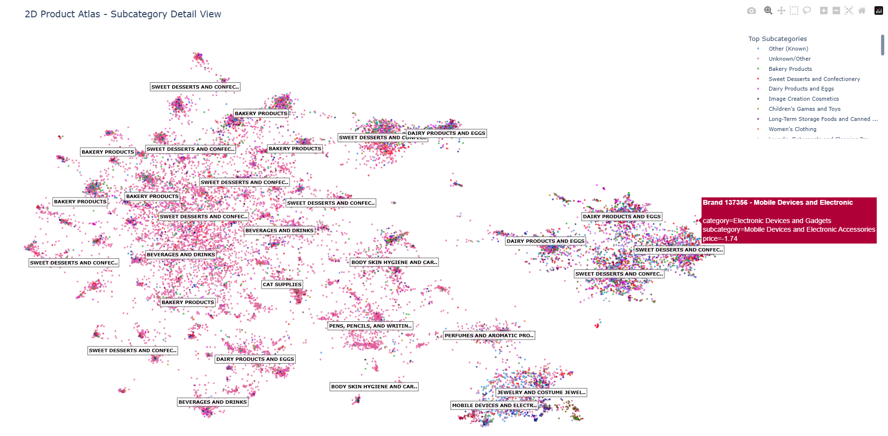
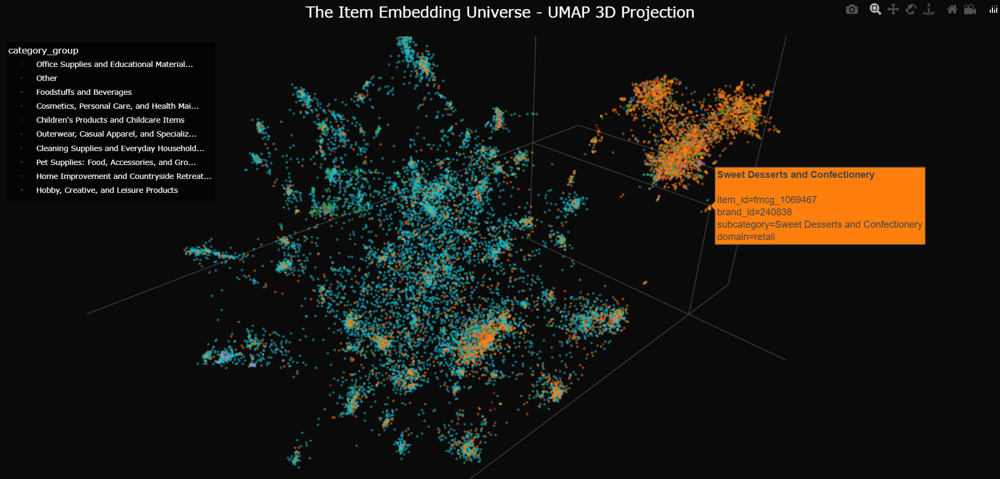

# Sequential Recommender System on T-ECD Dataset


## Overview
This project implements and evaluates sequential recommendation architectures to predict user purchasing behavior in a cross-domain e-commerce environment. By transitioning from recurrent baselines (GRU4Rec) to self-attentive mechanisms (SASRec), the system effectively captures long-term dependencies in user interaction sequences. The final model achieves a **Hit Rate@10 of 31.77%** and **NDCG@10 of 17.02%**.

## Dataset: T-ECD
The [**T-Tech E-commerce Cross-Domain (T-ECD)**](https://huggingface.co/datasets/t-tech/T-ECD) dataset serves as the foundation for this study. It captures granular user interactions across two distinct retail environments:
*   **Scale:** 9.2 million interaction events across 286,000 unique users.
*   **Domains:**
    *   **Retail (FMCG):** High-frequency, low-cost items (Fast-Moving Consumer Goods).
    *   **Marketplace (General Merchandise):** Long-tail, diverse inventory.
*   **Sparsity:** The data exhibits a classic long-tail distribution, where a small fraction of popular items accounts for the majority of interactions, presenting a challenge for cold-start recommendation.

## Methodology

### 1. Data Engineering
Raw transaction logs are processed into dense sequences suitable for deep learning:
*   **Sequence Padding:** User histories are truncated or padded to a fixed length of **50 interactions**.
*   **Interaction Coding:** Events are encoded hierarchically (Click, Add-to-Cart, Purchase) to capture intent strength.
*   **Noise Filtering:** Sessions with fewer than 3 interactions are removed to ensure model stability.

### 2. Latent Representation
We learn a shared **128-dimensional embedding space** for over 450,000 items. This dense vector space captures semantic similarities between products, allowing the model to generalize across the Retail and Marketplace domains. Dimensionality reduction techniques (UMAP/t-SNE) are employed to visualize these clusters in 2D and 3D space.


*Interactive version available: [assets/product_atlas_2d_subcat.html](assets/product_atlas_2d_subcat.html)*


*Interactive version available: [assets/universe_map.html](assets/universe_map.html)*

### 3. Model Evolution
The project follows a comparative approach:
*   **Baseline (GRU4Rec):** A Gated Recurrent Unit network that processes sequences step-by-step. While effective for short-term context, it suffers from the vanishing gradient problem in longer sequences.
*   **Core Model (SASRec):** A **Self-Attentive Sequential Recommender** based on the Transformer architecture. It utilizes:
    *   **Multi-Head Self-Attention:** Parallel processing of all items in a sequence to capture global dependencies.
    *   **Positional Embeddings:** Learnable vectors to encode the order of interactions.
    *   **Causal Masking:** Ensures predictions depend only on past events, preventing future leakage.


## Repository Structure

```text
├── analysis.ipynb                # Exploratory Data Analysis (EDA) of T-ECD
├── cleaning.ipynb                # ETL pipeline: Preprocessing and sequence generation
├── item_embeddings.ipynb         # Learning 128-dim item vectors & UMAP visualization
├── rnn_recommender.ipynb         # Baseline Model: GRU4Rec implementation
└── sequential_recommender.ipynb  # Core Model: SASRec (Transformer) implementation
```

## Results

We evaluate performance using **Hit Rate (HR@K)** and **Normalized Discounted Cumulative Gain (NDCG@K)**. The transition to a Transformer-based architecture yielded substantial improvements across all metrics.

| Metric       | GRU4Rec (Baseline) | SASRec (Transformer) | Improvement |
| :----------- | :----------------- | :------------------- | :---------- |
| **HR@10**    | 22.55%             | **31.77%**           | +40.9%      |
| **NDCG@10**  | 11.99%             | **17.02%**           | +41.9%      |
| **Accuracy** | 4.04%              | **5.87%**            | +45.3%      |

*Note: Results are based on the test set of 26,638 held-out users.*

## Run the pipeline
Execute the notebooks in the following order to reproduce the results:
1.  `analysis.ipynb` (Optional: Explore data)
2.  `cleaning.ipynb` (Required: Generate sequences)
3.  `item_embeddings.ipynb` (Required: Train embeddings)
4.  `sequential_recommender.ipynb` (Train and evaluate SASRec)
